# Angular and ASP.NET Core Sample App

Tutorial on how to build an Angular - ASP.NET Core web application

**Application Overview:**

- build service layer with the ASP.NET Web API for the back end, to expose the required endpoints to create, read, update, and delete entries
- build a UI using Angular with Bootstrap;
- implement NgRx—a framework for building reactive applications in Angular—in your app;
- implement user authentication with Auth0.  

<br/>  

## A. Setting Up the App Infrastructure

### 1. .NET Core Templates

- Type in the terminal `$ dotnet new angular` to build a new angular project
- Run the project - `dotnet run` and click on the localhost link; this will open the build in template.

### 2. Web API architectural overview

- *ClientApp* folder has the Angular-related files
- *Controllers* folder has all the Web API controllers
- *Pages* folder; inside this folder we have three files, and the most important one is the *ViewImports.cshtml*, which is used to import all the necessary libraries that we can use throughout the views.  
For example the TagHelpers:
```
@using Augusta_Tech___Rural_Sourcing
@namespace Augusta_Tech___Rural_Sourcing.Pages
@addTagHelper *, Microsoft.AspNetCore.Mvc.TagHelpers
```
- *wwwroot* folder is known as the root folder for the .NET Core apps. And this folder is mainly used to store static files like images, documents...
- *Program.cs* file is the entry file for the .NET apps. In here we can see the ```Main``` method, and inside the Main method we have the ```CreateWebHostBuilder``` method. And inside this method we can see that we have configured as our startup file, the Startup.cs file. 
```C#
    public class Program
    {
        public static void Main(string[] args)
        {
            CreateHostBuilder(args).Build().Run();
        }

        public static IHostBuilder CreateHostBuilder(string[] args) =>
            Host.CreateDefaultBuilder(args)
                .ConfigureWebHostDefaults(webBuilder =>
                {
                    webBuilder.UseStartup<Startup>();
                });
    }
```
- *Startup.cs* file which is also known as the configuration file; like the database connection strings, the services that we want to use,...  
Inside the Startup.cs we have two methods, the ```ConfigureServices``` and the ```Configure``` methods. The ConfigureSevices method is used to configure dependency interaction; the Configure method which is used to setup middle wares, routing rules,... So for example if we want to use a service in the future, we can configure it inside the ConfigureServices method.  

### 3. Angular Architectural Overview

- Angular files that were created inside the **ClientApp folder** by default:  
  1. **e2e** -  used for unit testing related code
  2. **node_modules** - libraries that we need to use to run our Angular app
  3. **src** - *all the code goes in here;* inside the source folder:  
     - **app** - Inside this folder we define the modules.  
	   - Here we have all components like **counter**, **fetch-data**,...
	   - **app.component.html** entry point file in Angular applications. If we open this file we're going to see in here that we have defined the menu and the body of our application.  
	   ```C#
	   <body>
		  <app-nav-menu></app-nav-menu>
		  <div class="container">
			<router-outlet></router-outlet>
		  </div>
	   </body>
	   ```  
	   - **app.module.ts** - configuration file in Angular projects; here we define all the components that we want to use, we define all the modules that we want to use and also the router for our Angular app.  
	   - **asset** folder - keep the static files like for example the icon, images, documents... 
	   - **environments** -  we have the two environment files like the production environment and the development environment where we define all the specific information that we want to use for each environments.  
	   - **index.html** - where we define the route component where in this case we have defined the app-route.  
	   ```HTML
	   <!DOCTYPE html>
		<html lang="en">
		  <head>
			<meta charset="utf-8" />
			<title>Augusta_Tech___Rural_Sourcing</title>
			<base href="/" />

			<meta name="viewport" content="width=device-width, initial-scale=1" />
			<link rel="icon" type="image/x-icon" href="favicon.ico" />
		  </head>
		  <body>
			<app-root>Loading...</app-root>
		  </body>
		</html>
	   ```  
	   - **angular.json** - define the Angular related configurations like for example where do we get the styles from? Which is the assets folder?...  
	   - **package.json** - define scripts like for example the script to build the Angular app which is the ng build, the script to run the test and even the dependencies like Angular animations, common, compiler...  

<br/>  

## B. Setting Up Web API

### 1. Creating Data Models  

- Data Models are used as signature for the way we want the database tables to look.  
- So, its model field will be translated into a database table field.  
- create a new folder; Data - all data related files like models, services,...
  - inside the Data folder, create another folder; Models
  - create new file Book.cs - C# file which is going to represent our books model.
	- define in here the namespace
	- write in your public class, the name is Book and then inside here we can define all the properties. 
	- optional fields - we don't always require the user to provide the value. To make this fields nullable, we just write the question mark after the datatype
	```C#
	using System;
	namespace Augusta_Tech___Rural_Sourcing.Data{
		public class Book
		{
			public int Id { get; set; }
			public string Title { get; set; }
			public string Author { get; set; }
			public string Description { get; set; }
			public double? Rate { get; set; }
			public DateTime? DateStart { get; set; }
			public DateTime? DateRead { get; set; }

		}
	} 
	```  
<br/>  


### 2. Adding a Service and Data
- here we use a static file from which we will get the data to work with. 
- create service, and configuring it. 
- Inside the Data folder, create folder Services  
  - inside here create interface - IBookService.cs. 
  ```C#
	using System.Collections.Generic;

	namespace Augusta_Tech___Rural_Sourcing.Data{
		public interface IBookService
		{
			List<Book> GetAllBooks();
			Book GetBookById(int id);
			void UpdateBook(int id, Book newBook);
			void DeleteBook(int id);
			void AddBook(Book newBook);
		}
	}
  ```
  - create service - BookService.cs.  
  ```C#
	using System.Collections.Generic;

	namespace Augusta_Tech___Rural_Sourcing.Data{
		public class BookService : IBookService
		{
			public void AddBook(Book newBook)
			{
				throw new System.NotImplementedException();
			}

			public void DeleteBook(int id)
			{
				throw new System.NotImplementedException();
			}

			public List<Book> GetAllBooks()
			{
				throw new System.NotImplementedException();
			}

			public Book GetBookById(int id)
			{
				throw new System.NotImplementedException();
			}

			public void UpdateBook(int id, Book newBook)
			{
				throw new System.NotImplementedException();
			}
		}
	}
  ```  
  - go to the startup.cs file and configure this service
    - inside the ```ConfigureServices()``` method, just after the ```AddSpaSaticFiles```, add ```services.AddTransient<IBookService, BookService>();```, which means that we are going to create a new reference to our service each time we use it in a different controller. So, which is the file that we want to inject in our controllers, that is going to be the IBookService and which is the implementation of this file, the implementation is the bookService.
  - create a static file which is a list of books.  
    - go to the data folder; inside here create a file - Data.cs. 
	  Inside here, we are going to have static class which is used to return data to our users. 
	  ```C#
		using System;
		using System.Collections.Generic;

		namespace Augusta_Tech___Rural_Sourcing.Data
		{
			public static class Data
			{
				public static List<Book> Books => allBooks;

				private static List<Book> allBooks = new List<Book>()
				{
					new Book()
					{
						Id=1,
						Title="Managing Oneself",
						Description="We live in an age of unprecedented opportunity: with ambition, drive, and talent, you can rise to the top of your chosen profession, regardless of where you started out...",
						Author= "Peter Ducker",
						Rate= (double)4.9,
						DateStart = new DateTime(2019,01,20),
						DateRead = null
					},
					new Book()
					{
						. . . 
					}
				};
			}
		}
	  ```  
<br/>  

### 3. Create API Endpoints 

- Create a **Controllers** folder which will have the **API Endpoints**. 
- Inside the Controllers folder and create a new Controller file - *BooksController.cs*
  - Define the namespace and inside here create all book controllers
  - Define the route for this controller - ```[Route("api/[controller]")]``` 
  - Inherit ```Controller``` base class, for a class to be a controller which is the AspNetCore.mvc
  - Create a field to use BookService with ```IBookService``` and Inject BookService in our constructor. 
  - To create the constructor type ctor + Double tap.  
	```C#
	using Augusta_Tech___Rural_Sourcing.Data;
	using Microsoft.AspNetCore.Mvc;

	namespace Augusta_Tech___Rural_Sourcing.Controllers
	{
		[Route("api/[controller]")]
		public class BooksController: Controller
		{
			private IBookService _service;
			
			public BooksController(IBookService service)
			{
				_service = service;
			}
		}
	}
	```  

  ### a) Add - API Endpoint

  - Feature to add a new book 
  - Inside BooksController.cs add our first API endpoint. the ```AddBook``` method add a new API endpoint - send an HTTP post request; the URL for this request is AddBook - ```[HttpPost("AddBook")]```  
  - Pass as a body request book object that we want to add to our data - ```public IActionResult AddBook([FromBody]Book book)```  
  - Use the service that we just injected, to add our book to our collection - ```_service.AddBook(book);```  
  - Return a success response - ```return Ok("Added");```  
  BooksController.cs final code:
	```C#
	using Augusta_Tech___Rural_Sourcing.Data;
	using Microsoft.AspNetCore.Mvc;

	namespace Augusta_Tech___Rural_Sourcing.Controllers
	{
		[Route("api/[controller]")]
		public class BooksController: Controller
		{
			private IBookService _service;
			public BooksController(IBookService service)
			{
				_service = service;
			}

			//Create/Add a new book
			[HttpPost("AddBook")]
			public IActionResult AddBook([FromBody]Book book)
			{
				_service.AddBook(book);
				return Ok("Added");
			}
		}
	}
	```  
  - Return to ```BookService.cs``` and implemented the ```AddBook()``` method by adding the System.Collections.Generic.List```Add()``` method to add a book to our collection.in - (Adds the elements of the specified collection to the end of the)  
	```C#	
	public void AddBook(Book newBook)
	{
		Data.Books.Add(newBook);
	}
	```  

  ### b. Read All - API Endpoint

  - Feature to return all books. 
  - Inside BooksController.cs after the ```AddBook``` method add a new API endpoint - HTTP get request; the name of the URL is going to be the same as the action name - ```[HttpGet("[action]")]```  
  - Define the implementation; use the service and return them to the users  
	```C#
	//Read all books
	[HttpGet("[action]")]
	public IActionResult GetBooks(){
		var allBooks = _service.GetAllBooks();
		return Ok(allBooks);
	}
	```  
  - Return to ```BookService.cs``` and implemented the ```GetAllBooks()``` method; return the Books collection with the ToList() by importing System.Link namespace.  
	```C#
	public List<Book> GetAllBooks()
	{
		return Data.Books.ToList();
	}
	```  

  ### c. Update - API Endpoint

  - Feature to update a book.  
  - Inside BooksController.cs after the ```GetBooks``` method add a new API endpoint - HTTP put request; define the URL name with the endpoint UpdateBook and pass in the book ID as the parameter - ```[HttpPut("UpdateBook/{id}")]```  
  - Define the implementation; use the service and return the Okay book. 
	```C#
	//Update an existing book
	[HttpPut("UpdateBook/{id}")]
	public IActionResult UpdateBook(int id, [FromBody]Book book)
	{
		_service.UpdateBook(id, book);
		return Ok(book);
	}
	```
  - Return to ```BookService.cs``` and implemented the ```UpdateBook()``` method; So before we update a book, we need to first get the old data. For that use the Data.Books.Firstordefault and goes to n.id is equal to the ID parameter. Now we check if we have an existing book. So if the old book is different from null, we are going to update this book.
	```C#
	public void UpdateBook(int id, Book newBook)
	{
		var oldBook = Data.Books.FirstOrDefault(n => n.Id == id);
		if(oldBook != null)
		{
			oldBook.Title = newBook.Title;
			oldBook.Author = newBook.Author;
			oldBook.Description = newBook.Description;
			oldBook.Rate = newBook.Rate;
			oldBook.DateStart = newBook.DateStart;
			oldBook.DateRead = newBook.DateRead;
		}
	}
	```

  ### d. Delete - API Endpoint

  - Feature to delete a book. 
  - Inside BooksController.cs after the ```UpdateBook``` method add a new API endpoint - HTTP delete request; define the URL name with the API endpoint DeleteBook and pass in the book ID as the parameter - ```[HttpDelete("DeleteBook/{id}")]```  
  - Definte the implementation; use the service and return Ok as the result.
	```C#
	//Delete a book
	[HttpDelete("DeleteBook/{id}")]
	public IActionResult DeleteBook(int id)
	{
		_service.DeleteBook(id);
		return Ok();
	}
	```  
  - Return to ```BookService.cs``` and implemented the ```DeleteBook()``` method; find the book, and then remove this book from our collection.  
	```C#
	public void DeleteBook(int id)
	{
		var book = Data.Books.FirstOrDefault(n => n.Id == id);
		Data.Books.Remove(book);
	}
	```  
	
  ### e. Read Single - API Endpoint 

  - Feature to retreive a book. 
  - Inside BooksController.cs after the ```DeleteBook``` method add a new API endpoint - HTTP get request; define the URL name with the API endpoint SingleBook and pass in the book ID as the parameter - ```[HttpGet("SingleBook/{id}")]```  
  - Define the implementation; use the service and return Ok book.  
	```C#
	//Get a single book by id
	[HttpGet("SingleBook/{id}")]
	public IActionResult GetBookById(int id)
	{
		var book = _service.GetBookById(id);
		return Ok(book);
	}
	```  
  - Return to ```BookService.cs``` and implemented the ```GetBookById()``` method; return from the data that books where the book ID is first or default.  
	```C#
	public Book GetBookById(int id)
	{
		return Data.Books.FirstOrDefault(n => n.Id == id);
	}
	```  
  ### Testing API endpoints using Postman
  - run the application in VS Code terminal - ```dotnet run```  
  - copy the local host link - https://localhost:5001
  - open Postman and create a new Http Request:  
    - Get request to return all books - https://localhost:5001/api/Books/GetBooks
	- Get request to return a single book - https://localhost:5001/api/Books/SingleBook/1
	- Put request to update a book - https://localhost:5001/api/Books/UpdateBook/1  
	  Click the Headers tab and type in Content-Type as the Key, and application/json as the value;  
	  Click the Body tab and select Raw; copy and paste the book here you want to update; modify this book and Send  
	- Post request to add a new book - https://localhost:5001/api/Books/AddBook  
	  Click the Body tab and select Raw and type in a new book; Send and we should get an Added response.
	- Delete request to delete a book - https://localhost:5001/api/Books/DeleteBook/20  

<br/>  

## C. Getting Started with Angular

### 1. Angular Key Concepts  
<br/>  

#### Modules

Blocks of functionalities that belong together.  
An important Angular module which comes by default when generating an Angular app, is the *app module*, which is also known as the *config module*, as here we get to configure the components, providers, bootstrappers, etc.  

```TypeScript
import { BrowserModule } from '@angular/platform-browser';
import { NgModule } from '@angular/core';
@NgModule({
  declarations: [ AppComponent ],
  imports: [ BrowserModule ],
  providers: [ Logger ],
  bootstrap: [ AppComponent ]
})
export class AppModule { }
```  

#### Components
Defines the behavior of a portion of a screen; a single feature, like showing all books, creating, deleting, etc. 
Inside a component we have:
- Template - a template is an HTML that defines how the view for that component is rendered.
- Directive - are custom attributes that enhance the HTML syntax and are used to attach behaviors to specific elements on that page.
- Data Binding - is a process that connects a component to its template and allows data and events to flow between them.  
<br/>
A component is decorated with the ```@Component``` syntax. Inside the component we define:  
- the selector - which is a name that we want to use to render the view
- the templateURL - which is the HTML file for this component  
- providers for services
- and also we can define in here the CSS code, which is going to be applied to this HTML only.  

```TypeScript  
@Component({
  selector: 'app-home',
  templateUrl: './home.component.html',
})
export class HomeComponent {
}
```  

#### Services
Define reusable functionalities that are independent of the views. This means that we can use a single service in different components.  
*Dependency injection* is a way to supply dependencies and to supply services to different classes or components, we use dependency injection, and to use a service in Angular, we need to inject it in the components constructor.  
<br/>

### 2. Generating Components and Services  

Before we start developing our Angular app, let us first create all the components and services that we will use.  

- Install the Angular CLI which is an Angular Command Line Interface used for creating components, services, etc.  
  ```$ npm install -g @angular/cli```  
- Inside ClientApp -> src -> app folder create two new folders,  
  one folder for the components,  
  and another folder for services.  

**Create the Components** - for that, go in the components folder, right-click, and then open in Terminal; this takes you to the componets path.    
To create a component, use the Angular CLI ng generate:  
  - Create the *display all books component* - ```$ ng g c books -m app```  
	'g' stands for generate;  
	'c' stands for component;  
	name of the component;  
	define to which module the books component will belong; we are placing the books components inside the app.module.ts module;    
  - Create the *delete book component* - ```$ ng g c delete-book -m app```  
  - Create the *new book component* - ```$ ng g c new-book -m app```  
  - Create the *show book component* for displaying a single book details - ```$ ng g c show-book -m app```  
  - Create the *update book* - ```$ ng g c update-book -m app```  
	If you want to confirm that component were successfully created, you can go to the *app.module.ts* file.  
	And in here, see that the components are now in the declarations array.  
	```TypeScript
	import { BooksComponent } from './components/books/books.component';
	import . . . 
	```  
    Also you can see all the component folders being created inside the componets folder alongwith their css, html, spec.ts, and ts files.  
<br/>

**Create the Service** - for that, go to the services folder. Right-click, and then open in Terminal; this takes you to the services path.  
To create the service, use the Angular CLI ng generate - ```$ ng g s book```  
This will generate the service; and adds the .spec.ts and ts file inside the services folder.  
  - Inside the *app.module.ts* file we can now see all the components that we just created.  
  - To be able to use this book service, include it in the providers array - ```providers: [BookService]```  
  - Import the necessary namespace, which is the ```import { BookService } from "./services/book.service";```   
    <br/>  
	Here is the complete app.module.ts file:  
	```TypeScript
	import { BrowserModule } from "@angular/platform-browser";
	import { NgModule } from "@angular/core";
	import { FormsModule } from "@angular/forms";
	import { HttpClientModule, HTTP_INTERCEPTORS } from "@angular/common/http";
	import { RouterModule } from "@angular/router";

	import { AppComponent } from "./app.component";
	import { NavMenuComponent } from "./nav-menu/nav-menu.component";
	import { HomeComponent } from "./home/home.component";
	import { CounterComponent } from "./counter/counter.component";
	import { FetchDataComponent } from "./fetch-data/fetch-data.component";
	import { BooksComponent } from "./components/books/books.component";
	import { DeleteBookComponent } from "./components/delete-book/delete-book.component";
	import { NewBookComponent } from "./components/new-book/new-book.component";
	import { ShowBookComponent } from "./components/show-book/show-book.component";
	import { UpdateBookComponent } from "./components/update-book/update-book.component";
	import { BookService } from "./services/book.service";

	@NgModule({
	  declarations: [
		AppComponent,
		NavMenuComponent,
		HomeComponent,
		CounterComponent,
		FetchDataComponent,
		BooksComponent,					//=>
		DeleteBookComponent,			//=>
		NewBookComponent,				//=>   ... our new componets
		ShowBookComponent,				//=>
		UpdateBookComponent				//=>
	  ],
	  imports: [
		BrowserModule.withServerTransition({ appId: "ng-cli-universal" }),
		HttpClientModule,
		FormsModule,
		RouterModule.forRoot([
		  { path: "", component: HomeComponent, pathMatch: "full" },
		  { path: "counter", component: CounterComponent },
		  { path: "fetch-data", component: FetchDataComponent }
		])
	  ],
	  providers: [BookService],			//=>   add new service here 
	  bootstrap: [AppComponent]
	})
	export class AppModule {}
	```  
<br/>

### 3. Cleaning up code and updating the router  
In our Angular app clean up the code from the existing components that we do not need; and update the router so it uses our components.  
 - Inside the *ClientApp -> src -> app* folder we have a couple of components outside the components folder - counter, fetch-data, home, and nav-menu.  
   We only want the home and the nav-menu components - just drag and drop them inside the components folder.  
   We don't need the counter and the fetch-data components - remove these components.  
 - **Update the router** - for that, go inside the *app.module.ts* file; this is our config file for the router.  
   - remove the counter and the fetch-data component imports.  
   Then, change the URL for the nav-menu. Now, the nav-menu is going to be /components, and we do the same for the home component by just writing in here, components.  
   Scroll down to the declarations array, and remove from here the CounterComponent and the FetchDataComponent.  
   Scroll down to the router module. In here we want to modify this module, so it matches with our components. Add all the new paths (URL's) following which component we want to render for that path; (we can remove the pathmatch: 'full' from here).  
   ```TypeScript
       RouterModule.forRoot([
      { path: "", component: HomeComponent, pathMatch: "full" },
      { path: "books", component: BooksComponent },
      { path: "new-book", component: NewBookComponent },
      { path: "update-book/:id", component: UpdateBookComponent },
      { path: "delete-book/:id", component: DeleteBookComponent },
      { path: "show-book/:id", component: ShowBookComponent }
    ])
   ```  
   One last thing that we need to change is that we need to go to the nav-menu, and then go inside the nav-menu.component.html. So here we want to have only two options. The first option is going to be when we want to add a new book. So for that, we just write in here the name of the link, is going to be Add, and the route link new-book. The other option is going to be all books, or we can just write in here Books, and the URL for this one is going to be /books.  
   ```HTML
           <ul class="navbar-nav flex-grow">
          <li
            class="nav-item"
            [routerLinkActive]="['link-active']"
            [routerLinkActiveOptions]="{ exact: true }"
          >
            <a class="nav-link text-dark" [routerLink]="['/new-book']">Add</a>
          </li>
          <li class="nav-item" [routerLinkActive]="['link-active']">
            <a class="nav-link text-dark" [routerLink]="['/books']">Books</a>
          </li>
        </ul>
   ```  
   Now run the application make sure you have the dotnet terminal ```dotnet run```  
   Here we see the new navigation for the application.     
   Now, change the homepage. For that, we need to go to the homepage component - ClientApp -> src -> app -> components -> home component ->*home.component.html*. Save the changes, and go back to our app to see the new homepage design:
   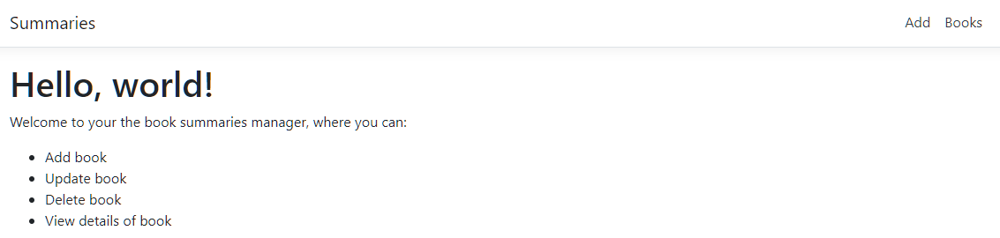  

<br/>

### 4. Designing the Books Page

- Go to ClientApp -> src -> app -> components -> books -> *books.component.ts* file.  
  Inside the ```BooksComponent``` class create a public array which is going to be used to hold all the books.  
  ```TypeScript
	import { Component, OnInit } from "@angular/core";

	@Component({
	  selector: "app-books",
	  templateUrl: "./books.component.html",
	  styleUrls: ["./books.component.css"]
	})
	export class BooksComponent implements OnInit {
	
	  public books: Book[];		   //=> array which is going to be used to hold all the books

	  constructor() {}

	  ngOnInit() {}
	}
  ```
- Create a book interface to hold the data; inside the app folder create a folder named interfaces and inside the interfaces folder create new file named *book.ts*.  
  ```TypeScript
  interface Book 
  {
	  id: number;
	  title: string;
	  description: string;
	  author: string;
	  rate?: number;
	  dateStart?: Date;
	  dateRate?: Date;
  }
  ```  
  
- Go to the *books.component.html* file and design the view.  
  ```HTML
    <h1>Book summaries</h1>

	<p *ngIf="!books"><b>Loading...</b></p>

    <!--The table will have the default bootstrap classes of table and then table dash striped;
        and we want to display this table only if the books array has data 
	-->
	<table class="table table-striped" *ngIf="books">
	  <thead>
		<tr>
		  <th>Title</th>
		  <th>Description</th>
		  <th>Author</th>
		  <th>Rate</th>
		  <th>Date Started</th>
		  <th>Date Read</th>
		  <th>Status</th>
		  <th>Action</th>
		</tr>
	  </thead>
	  <tbody>
		<tr *ngFor="let book of books">
		  <td>{{ book.title }}</td>
		  <td>{{ book.description | slice: 0:50 }}...</td>      //=> get the first 50 characters
		  <td>{{ book.author }}</td>
		  <td>{{ book.rate }}</td>
		  <td>{{ book.dateStart | date: "dd/MM/yyyy" }}</td>   //=> the date format.
		  <td>{{ book.dateRead | date: "dd/MM/yyyy" }}</td>
		  <td>
			{{
			  book.dateRead
				? "Read"
				: book.dateStart
				? "In Progress"
				: "Not Started"
			}}
		  </td>
		  <td>
			Actions
		  </td>
		</tr>
	  </tbody>
	</table>

  ```
 - Open terminal and then type in here ```dotnet run```.  
   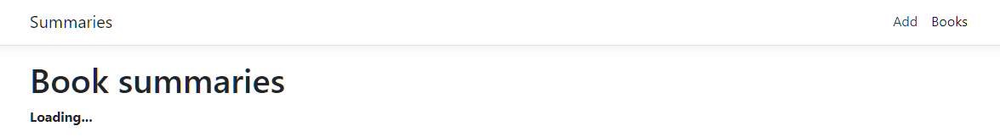   

<br/>

### 5. Reading Data from Angular
Modify the ts file to read the data from the web API - **Web API Data from Angular** 
- *Create a Method in Angular Service*  
- *Inject Service in Component*
- *Call Method from Angular Service*
- *Handle the response*  
  
  Go to ClientApp -> src -> app -> services -> *book.service.ts* file.  
  ```TypeScript
	// 1. define the base URL
	// 2. inject the HTTP client to be able to send HTTP requests to our Web API - cstr param
	// 3. create a method to get all books
	
	import { Injectable } from '@angular/core';
	import { HttpClient } from '@angular/common/http';

	@Injectable({
	providedIn: 'root'
	})
		export class BookService {

		_baseURL: string = "api/Books";				//=> base URL

		constructor(private http: HttpClient) { }		//=> inject HttpClient

		getAllBooks() {						//=> Create a Method in Angular Service
		return this.http.get<Book[]>(this._baseURL + "/GetBooks");
		}
	}
  ```
  Go to the components -> books -> *books.component.ts* file.  
  In here, inject this service, so we can use the method that we just created.  
  Then inside the ngOnInit, whenever the books component is initialized, we want to get all the books.  
  ```TypeScript
	import { Component, OnInit } from "@angular/core";
	import { BookService } from "src/app/services/book.service";

	@Component({
	  selector: "app-books",
	  templateUrl: "./books.component.html",
	  styleUrls: ["./books.component.css"]
	})
	export class BooksComponent implements OnInit {
	  public books: Book[];
	  
	  constructor(private service: BookService) {}	//=> inject the service we created

	  ngOnInit() {		
		this.service.getAllBooks().subscribe(data => {	//=> Call Method from Angular Service
		  this.books = data;				//=> Handle the Response
		})
	  }
	}  
  ```
  Right-click. Open in Terminal. Write in here dotnet run. Click on Books tab; all the books were loaded successfully.  
  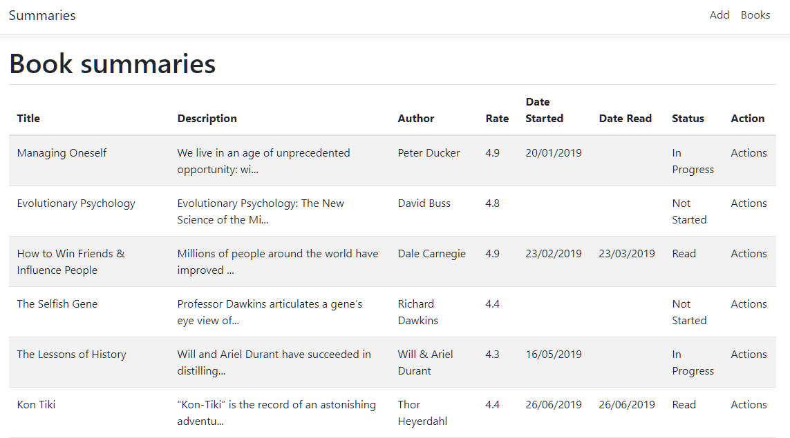  

<br/>

### 6. Designing the Create Page
Design the Create Page - to add new books to our collection.   

- Go to ClientApp -> src -> app -> components -> books -> new-book -> *new-book.component.html* file and design the view.  
  ```HTML
	<div class="add-book">
	<form action="">
		<div class="form-group">
			<label for="title" class="required">Title</label>
			<input type="text" class="form-control" id="title" placeholder="Book title">
		</div>
		<div class="form-group">
			<label for="author" class="required">Author</label>
			<input type="text" class="form-control" id="author" placeholder="Book author">
		</div>
		<div class="form-group">
			<label for="description" class="required">Description</label>
			<input type="text" class="form-control" id="description" placeholder="Book description">
		</div>

		<div class="row">
			<div class="col-md-4 col-xs-4 col-sm-4">
				<div class="form-group">
					<label for="dateStart">Date start</label>
					<input type="date" 
					class="form-control" 
					id="dateStart" 
					placeholder="Date start">
				</div>
			</div>
			<div class="col-md-4 col-xs-4 col-sm-4">
				<div class="form-group">
					<label for="dateRead">Date read</label>
						<input 
						type="date" 
						class="form-control" 
						id="dateRead" 
						placeholder="Date read">
				</div>
			</div>
			<div class="col-md-4 col-xs-4 col-sm-4">
				<div class="form-group">
					<label for="rate">Rate</label>
					<input type="number" min="0" max="5" class="form-control" 
					id="rate" placeholder="Rate">
				</div>
			</div>
		</div>
		<!--green button with class btn-success-->
		<button class="btn btn-success" type="submit">Add</button>
		<!--routerLink to redirect the user to all books--> 
		<button class="btn btn-default" [routerLink]="['/books']">Cancel</button> 

	</form>
	</div>
  ```
- Change the design;  
  -the width for this form - create a div with a class add-book.  
  -put a star next to the fields that are required, like the Title, the Author, and the Description.  
  Go to the CSS file for this HTML file - new-book -> *new-book.component.css*.  
  ```CSS
	.add-book{
		padding: 0 20% 0 20%;
	}

	.required:after{
		content:"*";
		color: red;
	}
  ```  
  Right-click. Open in Terminal. Write in here dotnet run. Click on Add tab  
  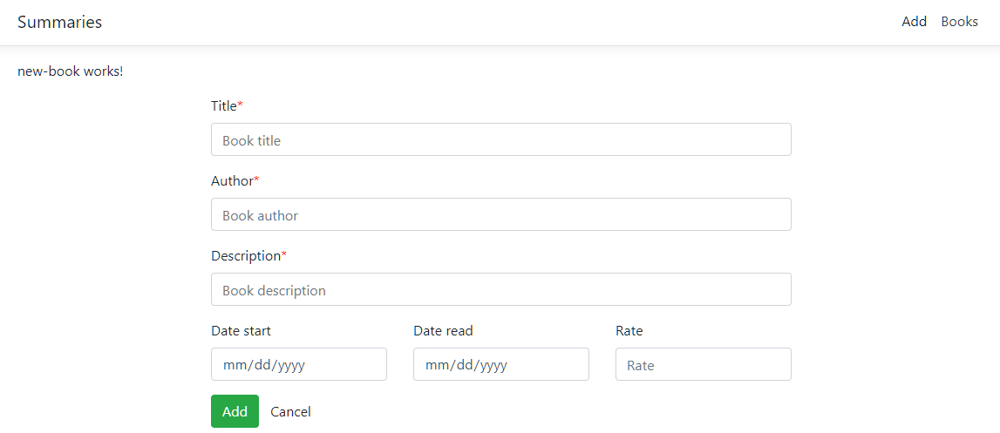  


<br/>

### 7. Adding New Data from Angular

Modify the ts file to Add the create functionality in our Angular app - **Web API Data from Angular** 
- *Create a Method in Angular Service*  
- *Inject Service in Component*
- *Call Method from Angular Service*
- *Handle the response*  


  Go to ClientApp -> src -> app -> services -> *book.service.ts* file.  
  Inside the ```BookService``` class add the following method:    
  ```TypeScript
  // create a method to add a books
    addBook(book: Book) {
    return this.http.post(this._baseURL+"/AddBook/",book);
  }
  ```  
  Go to the components -> new-book -> *new-book.component.ts* file.  
  Inside the ```NewBookComponent``` class, add the following:  
  - inject the BookService;    
  - Create a FormGroup, to use in the form - ```addBookForm```;
  - Inside the ```ngOnInit``` construct this FormGroup with a FormBuilder; to do so,
  - inject a FormBuilder;  
    ```TypeScript
	import { Component, OnInit } from "@angular/core";
	import { BookService } from "src/app/services/book.service";
	import { FormGroup, FormBuilder, Validators } from "@angular/forms";
	import { Router } from "@angular/router";

	@Component({
	  selector: "app-new-book",
	  templateUrl: "./new-book.component.html",
	  styleUrls: ["./new-book.component.css"]
	})
	export class NewBookComponent implements OnInit {
	  // create a formGroup to use in the form
	  addBookForm: FormGroup;

	  // inject the service
	  constructor(
		private service: BookService,
		private fb: FormBuilder,
		private router: Router
	  ) {}

	  ngOnInit() {
		// construct the formGroup
		this.addBookForm = this.fb.group({
		  id: [Math.floor(Math.random() * 1000)],
		  title: [null, Validators.required],
		  author: [null, Validators.required],
		  description: [
			null,
			Validators.compose([Validators.required, Validators.minLength(30)])
		  ],
		  rate: [null],
		  dateStart: [null],
		  dateRead: [null]
		});
	  }
	}
	```
  
  Go to the html file -*new-book.component.html* 
  - Before we modify the view, since we will be using the *Reactive Forms Module*, which provides a model-driven approach to handling form inputs whose values change over time, we need to import ```ReactiveFormsModule``` from the @angular/forms package and add it to your NgModule's imports array.  
    Go to *src/app/app.module.ts* and add ReactiveFormsModule  
	```TypeScript
		@NgModule({
		  imports: [
			// other imports ...
			ReactiveFormsModule
		  ],
		})
	```  
  - Inside the form tag define the form group; and define the submit event -  
    ```<form [formGroup]="addBookForm" (ngSubmit)="onSubmit()">```.
  - Next, for each input tag we need to define the form control name -  
    ```formControlName="title", formControlName="author", ...```  
  
  Now let us go back to our *component.ts* file and create the ```onSubmit``` method.  
  - The book value in here is going to come from the ```this.addBookForm.value```.  
  - To execute this request we need to write in here ```subscribe``` 
  - Once we have submitted this form, we want to redirect our users to the books list.  
    We need to inject the router ```private router: Router```  
	```TypeScript
	  onSubmit() {
		this.service.addBook(this.addBookForm.value).subscribe(data => {
		  this.router.navigate(["/books"]);
		});
	  }
	```  
  Go back to our controller ClientApp -> Controllers -> *BooksController.cs*; instead of returning the "Added" string let us remove it completely and save the changes - ```return Ok();```.  
  <br/>
  
  Run the application to see the result in action, (but first let's stop it because we added a new imported a new package; and reload the screen). Now we can add a new book and can see that we are redirected to the all books view and our book can be seen down here.  


<br/>

### 8. Designing the Book Details Page  

- Start by making the table in the Books Page wider - go to ClientApp/src/app/*app.component.html* from where we render the router outlet (where we render the content of each active component). Change the default ```container``` class to another class, like for example ```body-wrapper```.  
  ```HTML
	<body>
	  <app-nav-menu></app-nav-menu>
	  <div class="body-wrapper">
		<router-outlet></router-outlet>
	  </div>
	</body>
  ```  
  Go to the styles.css, ClientApp/src/styles.css and give this class some padding.  
  ```CSS
	.body-wrapper {
	  padding: 0 20px 0 20px;
	}
  ```  
- Go back to the books component ClientApp/src/components/books/*books.component.html* and add a Show button; define its classes, add a click event which executes the ```showBook``` method which takes a book as a parameter.  
  ```HTML
      <td>
        <button
          type="button"
          class="btn btn-default btn-sm"
          (click)="showBook(book.id)"
        >
          Show
        </button>
      </td>
  ```  
- Now go to the ts file and implement this method.  
  When this button is clicked, we want to redirect users from this component to the show-book component; for that inject the Router - ```constructor(private service: BookService, private router: Router) {}```  
  Next, use the ```router.navigate``` function inside the ```showBook``` method.  
  ```TypeScript
  showBook(id: number) {
    this.router.navigate(["/show-book/" + id]);
  }
  ```  
Here is the Books Page with the new Show button:
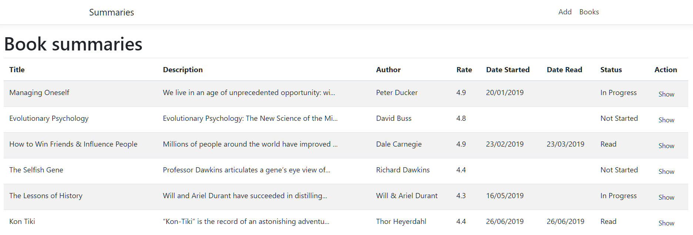  

- Now let's design the Details Page. Go to the showBook component and define the book that we are going to get from the database.  ClientApp/src/app/components/show-book/*show-book.component.ts*  
  ```TypeScript
    //define the book we are going to get from db
    book: Book;
  ```  
- Go to the *component.html* file and create the card that we are going to use to display the book detail.  
  Create a div with class```book-details```; give it some style in the css.  
  Create a div for our card, class of ```card``` and display this card only if we have a book ```*ngIf="book"```  
  Create a div for the card body and display in here the book attributes;  
  Create two links, one for canceling the action. So we are going to redirect the users to the books page (```[routerLink]="['/books']"```), and another one to redirect the users to the update page (```[routerLink]="['/update-book', book.id]"```).  
  ```HTML
	<div class="book-details">
	  <div class="card" *ngIf="book">
		<div class="card-body">
		  <h5 class="card-title">{{ book.title }}</h5>
		  <h6 class="card-subtitle mb-2 text-muted">by {{ book.author }}</h6>
		  <p>
			{{ book.description }}
		  </p>
		  <a [routerLink]="['/books']" class="card-link">Back</a>
		  <a [routerLink]="['/update-book', book.id]" class="card-link">Update</a>
		</div>
	  </div>
	</div>
  ```  
<br/>

### 9. Getting a single book from Angular  

Now that we have created the book details view, it's time to get the data from the Web API.   
- For that, we are going to create a method in our service.  
  Go to ClientApp/src/app/services/*book.service.ts* file. Inside the ```BookService``` class add:  
  ```TypeScript
  getBookById(id: number) {
    return this.http.get<Book>(this._baseURL + "/SingleBook/" + id);
  }
  ```  
- Then we are going to inject this service in our component.  
  Go to ClientApp/src/app/components/show-book/*show-book.component.ts* and inject the ```BookService``` in the constructor so we can use the method we just created inside ```ngOnInit```. Since we are going to get the id parameter for this method from the URL we also need to inject ```ActivatedRoute``` in the constructor.  
- And at the end, we are going to handle result. 
  ```TypeScript
	export class ShowBookComponent implements OnInit {
	  //define the book we are going to get from db
	  book: Book;

	  constructor(private service: BookService, private route: ActivatedRoute) {}

	  ngOnInit() {
		this.service.getBookById(this.route.snapshot.params.id).subscribe(data => {
		  this.book = data;
		});
	  }
	}
  ```  
Go to our app. So now in here we can see that we get the book details.   
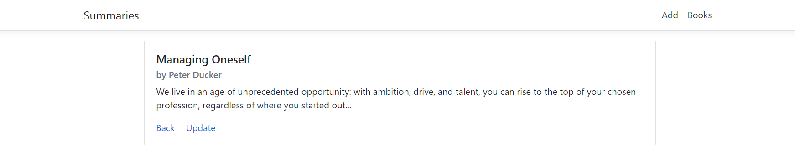
  
<br/>

### 9. Updating existing data from Angular

Modify the ts file to Add the create functionality in our Angular app - **Web API Data from Angular** 
- *Create a Method in Angular Service*  
- *Create view*
- *Create FormGroup*
- *Inject service*  
- *Handle response*  

  First create the service method; src/app/services/*book.service.ts*.  
  ```TypeScript
  updateBook(book: Book) {
    return this.http.put(this._baseURL + "UpdateBook/" + book.id, book);
  }
  ```  
  
  Create the view. The view in our case is like the new book.component.html. So, copy and paste the new-book html to update-html. In here make a few changes:  
  ```HTML
  <div class="update-book">    <!--Change this class to update-book-->
  <form [formGroup]="updateBookForm" (ngSubmit)="onSubmit()">    <!--Change the formGroup to updateGroup-->
  ...
      <button class="btn btn-success" type="submit">Update</button> <!--Change text to Update-->
	  ...
  ```  
  Add style to the css file - *update-book.components.css*  
  ```CSS
	.update-book {
	  padding: 0 20% 0 20%;
	}

	.required:after {
	  content: "*";
	  color: red;
	}
  ```  
  Go to the *update-book.component.ts* file and inject everything that we need.  
  - inject the service because we need a service to get a single book and then to send a put request - ```BookService```
  -  inject the route, to get the idea of the book from the URL ```ActivatedRoute```  
  - inject the router to navigate to all books after we have updated the books - ```Router```
  - inject the FormBuilder to construct our form group ```FormBuilder```  
    We declared in our html a form tag with a formGroup = updateBookForm ```<form [formGroup]="updateBookForm" (ngSubmit)="onSubmit()">```. We also need to create this formGroup inside the ts file; so right before the constructor add the next line - ```updateBookForm: FormGroup;```  
	
    inside ```gOnInit```, we are going to get the single book and construct our FormGroup. Here, we are going to first, get the book data - ```this.book = data;```; and for the book, create a book variable before the constructor; a book, that is of that any, or you can write off that book - ```book: any;```  
    And now, create ```UpdateBookForm```and import validation libraries.  
	Add a format for DateStart to be able to displayed; add the method at the end - ```formatDate(date: Date)```.  
	Lastly add functionality for the Update button; implement the ```onSubmit``` method. 
	```
	
	```
	```TypeScript
	import { Component, OnInit } from "@angular/core";
	import { BookService } from "src/app/services/book.service";
	import { ActivatedRoute, Router } from "@angular/router";
	import { FormBuilder, FormGroup, Validators } from "@angular/forms";

	@Component({
	  selector: "app-update-book",
	  templateUrl: "./update-book.component.html",
	  styleUrls: ["./update-book.component.css"]
	})
	export class UpdateBookComponent implements OnInit {
	  updateBookForm: FormGroup;
	  book: any;

	  constructor(
		private service: BookService,
		private route: ActivatedRoute,
		private router: Router,
		private fb: FormBuilder
	  ) {}

	  ngOnInit() {
		this.service.getBookById(this.route.snapshot.params.id).subscribe(data => {
		  this.book = data;

		  // construct the formGroup
		  this.updateBookForm = this.fb.group({
			id: [data.id],
			title: [data.title, Validators.required],
			author: [data.author, Validators.required],
			description: [
			  data.description,
			  Validators.compose([Validators.required, Validators.minLength(30)])
			],
			rate: [data.rate],
			dateStart: [this.formatDate(data.dateStart)],
			dateRead: [this.formatDate(data.dateRead)],
		  });
		});
	  }
	  //create a method to change the format of dateStart
	  formatDate(date: Date) {
		if (date) {
		  return new Date(date).toISOString().substring(0, 10);
		}
	  }
	  onSubmit() {
		this.service.updateBook(this.updateBookForm.value).subscribe(data => {
		  this.router.navigate(["/books"]);
		});
	  }
	}
	```  
	Update the HTML file - for description change the input to a textArea tag.
	Run the project and go to Books and pick a book by clicking on 'Show'; now click on 'Update' to update this book:  
	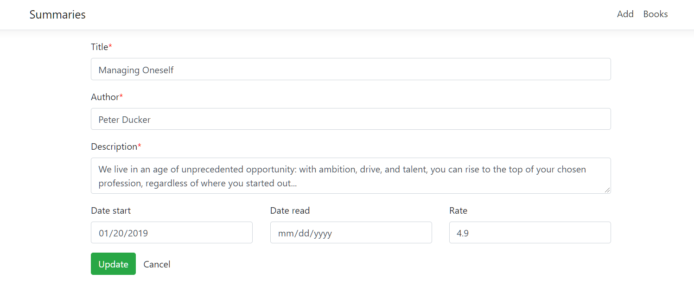

  
<br/>

### 10. Deleting data from Angular
- *Create a Method in Angular Service* - src/app/services/*book.service.ts*.  
```TypeScript
   deleteBook(id: number) {
     return this.http.delete(this._baseURL + "/DeleteBook" + id);
   }
```  
- *Create view* - go to our delete component src/app/component/*book.service.ts*.. Everything stays the same as the show-book component except the update button; add a click event which is going to run the deleteBook method with a parameter of book.id; also change the class from card link to btn-danger.  
```TypeScript
   <button (click)="deleteBook(book.id)" class="btn btn-danger">Approve</button>
```  
- *Implement the functionality* - go to the deleteBook.component.ts; 
  - inject the route, router and service.  
  ```TypeScript
  constructor(
    private route: ActivatedRoute,
    private router: Router,
    private service: BookService
  ) {}
  ```  
  - Inside the ngOnInit, get the detail for the book; this.book is equal to data, so create a book in here, leave it of type any;
  ```TypeScript
  ngOnInit() {
    this.service.getBookById(this.route.snapshot.params.id).subscribe(data => {
      this.book = data;
    });
  }
  ```  
  - Import the deleteBook method. And what this will do is that it will send a delete request by using the deleteBook service method. So, this.service.deleteBook id and then, subscribe. In here, we are just going to redirect the user to all the books.  
  ```TypeScript
  deleteBook(id: number) {
    this.service.deleteBook(id).subscribe(data => {
      this.router.navigate(["books"]);
    });
  }
  ```  
  - Add the Update and Delete Button to the books component html, which should direct us to the update-book and delete-book pages.
  ```TypeScript
          <button
          type="button"
          class="btn btn-success btn-sm"
          (click)="updateBook(book.id)"
        >
          Update
        </button>
        <button
          type="button"
          class="btn btn-danger btn-sm"
          (click)="deleteBook(book.id)"
        >
          Delete
        </button>
  ```  
  - Add the functionality to the books component ts file:  
  ```TypeScript
  updateBook(id: number) {
    this.router.navigate(["/update-book/" + id]);
  }
  deleteBook(id: number) {
    this.router.navigate(["/delete-book/" + id]);
  }
  ```
  Here is the Books page:  
  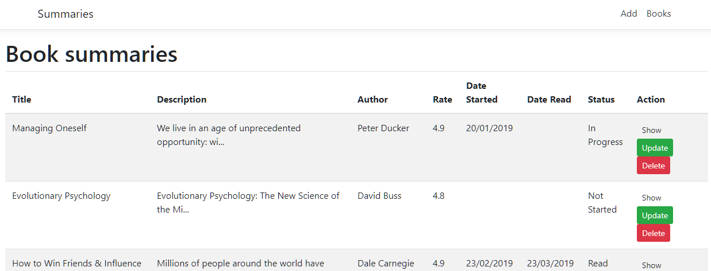  
  Here is the Delete page for approval:
  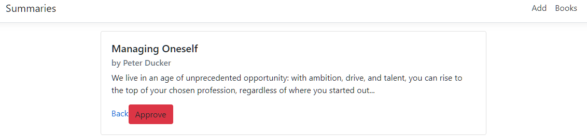
    
  
<br/>

### 11. Handling Errors in Angular  

So, let us say we want to add a new book. In here I'll not provide any data; if I click Add, the API endpoint is going to return a successful response. Add error handling functionality and fix this behavior in the web API.
- Go to  Controllers/*BooksController.cs* and add a try-catch block, to the ```AddBook``` method, which we are going to use to catch an exception, in case anything goes wrong.  
```C#
        //Create/Add a new book
        [HttpPost("AddBook")]
        public IActionResult AddBook([FromBody]Book book)
        {
            try
            {
                if (book.Author != null && book.Author != null && book.Description != null)
                {
                    _service.AddBook(book);
                    return Ok();
                }
                return BadRequest("Book was not added");

            } catch(Exception ex)
            {
                return BadRequest(ex.Message);
            }
        }
```  
- Now we are returning either success or failure from our API, but we need to handle this from the Angular part as well. 
  Go to the ClientApp/src/app/components/new-book/*new-book.component.ts* file. 
  Declare an error variable inside the ```NewBookComponent``` class - ```showError: boolean = false;```.
  Next, scroll down to the ```onSubmit``` method, and in this method, add the catch.  
  ```TypeScript
  onSubmit() {
    this.service.addBook(this.addBookForm.value).subscribe(
      data => {
        this.router.navigate(["/books"]);
      },
      error => {
        this.showError = true;
      }
    );
  }
  ```  
- Add an error in the HTML - got to the *new-book.component.html* file and create a div before the form:  
  ```HTML
  <div *ngIf="showError" class="alert alert-danger" role="alert">
    Book was not added to your library. Please try again.
  </div>
  ```  
  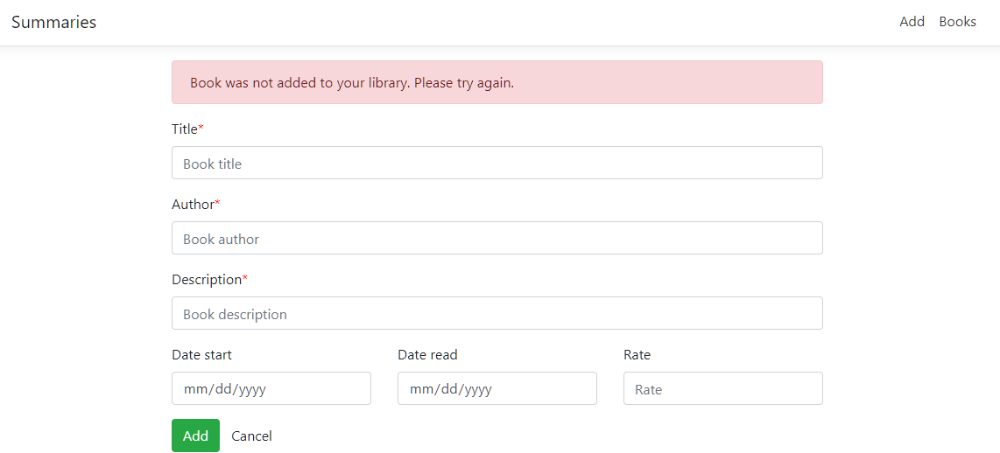  
- So, this is how you would handle it from the web API part, but it would be even better if we can simply prevent the users from sending a BadRequest - user should not even be able to press the Add button.  
  Go to the *new-book.component.html* and implement a div error message for title first.   
  Check for the different kinds of errors, because if we check it from the new-book.component.ts, we can have ```validators``` like ```required```, or ```minLength```, et cetera. So, now in here, I'll check for the required validator.
  ```HTML
    <div *ngIf="addBookForm.controls['title'].invalid && (addBookForm.controls['title'].dirty || addBookForm.controls['title'].touched)">
      <div *ngIf="addBookForm.controls['title'].errors.required">
        Book Title is required.
      </div>
    </div>
  ```  
  Do the same div's for Author and Description; add an additional div for the minLength error for description.
  Scroll down to the Add button, and we can add a condition in here to not display this button at all unless all the conditions are met.  
  ```HTML  
  <button class="btn btn-success" type="submit" [disabled]="addBookForm.pristine || addBookForm.invalid">Add</button>
  ```  
  Here is the Add Book page with error handling functionality:  
  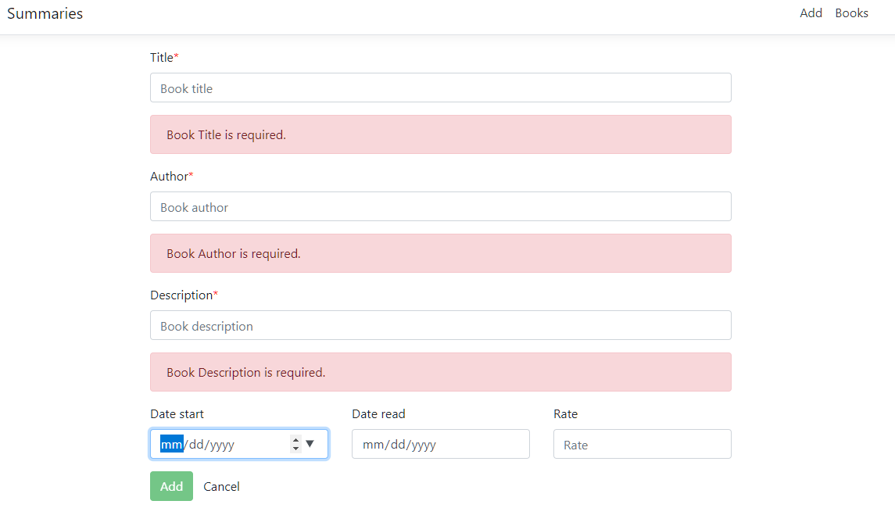  

<br/>  

## D. Implementing NgRx to an Existing Angular App

### 1. What is NgRx  

- [Narrator] Before we answer the why, let us answer the what. So, what is NgRx? To understand NgRx, we need to first understand the second part, Rx. Which is where everything starts from. Rx, or RxJS, is a reactive extensions library for JavaScript. So, RxJS is a library for reactive programming using observables to make it easier to compose asynchronous or callback-based code. So, NgRx is a Rx powered state management library for Angular applications. But which are the key NgRx concepts? NgRx has four key concepts, which are store, state, reducer, and actions. To put it simply, store is the database of our application. It stores different states defined in our app. And state is a single immutable data structure. So states are what make up the store. And the NgRx store serves as a client-side single source of truth. If the store is the database of the application, the reducers are the tables. The reducer is a pure function that accepts two parameters. An action, and the previous state with a type and optional data associated with the event. So, store keeps the state of the application, and reducers get the state of the store. But how do we update the store when we need to? That is the role of the actions. Actions represent payloads of information that are dispatched to the store from the application and are usually triggered by user interaction. Now, to recap a few points. The store stores the whole state. The reducers return fragments of the state. And actions are pre-defined user-triggered events that define how a state should change. Now let us illustrate this with an example to understand it even better. So let's say we have an app. And we have the view, or the UI. And then here we have a button. Now, from this button we can trigger an event. So, when we click a button we use an action to define how we want the state to change because we said that actions represent payloads of information that are dispatched to the store from the application and are usually triggered by user interaction. So, in this case, we button click. Now we dispatch the action to the store by using the dispatch method. Now, here we have a reducer, which we have said is a pure function that accepts two parameters. An action, and the previous state with a type and optional data associated with the event. The reducer will take these two parameters and return a new state which then we use to update the UI.  
<br/>  


 
		  
